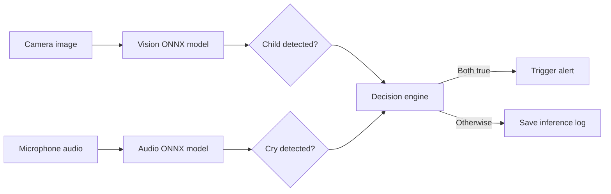

# CPDS-AI

> **Child Presence Detection System for Vehicles** — an AI research project that combines visual child detection and baby-cry recognition to support alerts for children left in vehicle cabins.

[](https://github.com/trtrung1209/CPDS-AI/actions/workflows/ci_pipeline.yml)

## Overview

CPDS-AI is designed as an offline-capable edge-AI pipeline. It combines two independent ONNX models:

| Pipeline | Model | Purpose |
| --- | --- | --- |
| Vision | YOLOv8 ONNX | Detects adults and children in a vehicle image or camera stream. |
| Audio | ResNet18-based ONNX classifier | Distinguishes baby cries from background noise. |

An alarm is triggered only when both signals are positive: a child is detected and the audio classifier identifies a cry. The target deployment path is a Raspberry Pi 4 during development and an Orange Pi 5/NPU for the final edge device.



## Key Features

- Real ONNX inference for the combined vision-and-audio decision.
- Dedicated vision verification with annotated output images.
- Optional live webcam inference for local development.
- Kaggle notebooks for training and export workflows.
- Automated tests with branch coverage enforced at **80% or higher**.
- Consecutive, readable Markdown reports for local test runs.
- Docker environment for headless inference deployment.

## Repository Layout

```text
CPDS-AI/
├── .github/workflows/       # GitHub Actions CI workflow
├── docker/                  # Inference Dockerfile
├── notebooks/               # Kaggle/Colab training notebooks
├── scripts/                 # Test-report generator
├── src/
│   ├── inference/           # ONNX, webcam, and combined inference modules
│   └── utils.py             # Run-directory and result persistence helpers
├── tests/                   # Unit, integration, notebook, and performance tests
├── run_tests.sh             # Full test suite with Markdown report
├── run_vision_tests.sh      # Vision-focused test and smoke-test helper
└── requirements.txt
```

The following paths are intentionally ignored by Git:

- `data/` — datasets and trained model artifacts.
- `runs/` — inference outputs.
- `test_reports/` — generated local test reports.
- `.env*`, `.kaggle/`, `venv/`, `.venv/`, and GitNexus caches — local configuration, environments, and tooling.

## Requirements

- Python 3.10 or newer.
- A virtual environment is recommended.
- A webcam is required only for the live camera demo.
- Kaggle GPU is recommended for model training.

## Installation

```bash
git clone https://github.com/trtrung1209/CPDS-AI.git
cd CPDS-AI

python3 -m venv .venv
source .venv/bin/activate

python3 -m pip install --upgrade pip
python3 -m pip install -r requirements.txt
```

## Train and Export Models on Kaggle

### Vision model

1. Create a Kaggle Secret named `ROBOFLOW_API_KEY` in **Add-ons → Secrets**.
2. Grant the vision notebook access to that secret.
3. Open `notebooks/02_vision_training.ipynb` in Kaggle and enable a GPU accelerator.
4. Update the Roboflow workspace, project, and version only if you use a different dataset.
5. Run all cells.

The notebook trains YOLOv8n, validates the generated ONNX file, then writes these artifacts to `/kaggle/working/artifacts/`:

```text
yolov8n-adult-child.onnx
vision_metadata.json
```

### Audio model

The notebook builds its working dataset under `/kaggle/working/cpds-audio` automatically. Its generated layout is:

```text
cpds-audio/
├── train/
│   ├── noise/
│   └── cry/
└── val/                    # Optional; an 80/20 split is used when omitted
    ├── noise/
    └── cry/
```

Enable Internet before running the audio notebook. It shallow-clones [Donate-a-cry](https://github.com/gveres/donateacry-corpus) and [ESC-50](https://github.com/karolpiczak/ESC-50), selects vehicle-relevant ESC-50 categories, excludes `crying_baby`, and writes a reproducibility manifest. No Kaggle Input dataset is required.

The audio notebook writes these files to `/kaggle/working/artifacts/`:

```text
audio_model.onnx
audio_labels.json
audio_dataset_manifest.json
```

### Download model artifacts

Download the generated files and place them locally under `data/models/`:

```text
data/models/
├── yolov8n-adult-child.onnx
├── vision_metadata.json
├── audio_model.onnx
└── audio_labels.json
```

Model files must not be committed to Git.

## Run Inference

### Combined vision and audio inference

```bash
python3 -m src.inference.run_inference \
  --image path/to/image.jpg \
  --audio path/to/audio.wav \
  --vision-model data/models/yolov8n-adult-child.onnx \
  --audio-model data/models/audio_model.onnx \
  --audio-labels data/models/audio_labels.json
```

The result is saved as `runs/runN/inference_log.json`.

### Verify a vision model on one image

```bash
python3 -m src.inference.verify_vision \
  --model data/models/yolov8n-adult-child.onnx \
  --image path/to/image.jpg
```

An annotated image is saved under `runs/runN/verified_output.jpg`.

### Verify an audio model

```bash
python3 -m src.inference.verify_audio \
  --model data/models/audio_model.onnx \
  --audio path/to/audio.wav \
  --labels data/models/audio_labels.json
```

### Evaluate an audio model

Prepare a deterministic, balanced evaluation set from the public sources (Internet access and `ffmpeg` are required):

```bash
python3 scripts/prepare_audio_evaluation_data.py --overwrite
python3 scripts/evaluate_audio_model.py \
  --model data/models/audio_model.onnx \
  --labels data/models/audio_labels.json \
  --test-dir data/test_audio \
  --report audio_evaluation_report.json
```

The evaluation command produces a machine-readable JSON report with accuracy, per-class precision/recall/F1, a confusion matrix, and per-file failures.

### Test microphone inference

This optional local-only tool needs microphone dependencies:

```bash
python3 -m pip install -r requirements-microphone.txt
python3 scripts/record_and_infer_audio.py \
  --model data/models/audio_model.onnx \
  --labels data/models/audio_labels.json
```

### Live webcam inference

Run this natively on the host machine; it needs camera and display access.

```bash
python3 -m src.inference.camera_vision --model data/models/yolov8n-adult-child.onnx
```

Press `q` in the preview window to stop.

## Testing and Markdown Reports

The test suite covers inference decisions, ONNX input/output validation, label handling, camera cleanup, notebook validity, and a post-processing performance guard. The full suite enforces 80% branch coverage.

```bash
# Run all tests with coverage enforcement.
python3 -m pytest

# Run all tests and create a persistent local Markdown report.
bash run_tests.sh

# Run the vision unit-test subset and create a Markdown report.
bash run_vision_tests.sh

# Run the vision subset plus a real ONNX smoke test.
bash run_vision_tests.sh --image test_anh.jpg data/models/yolov8n-adult-child.onnx

# Run the vision subset plus the webcam demo.
bash run_vision_tests.sh --camera data/models/yolov8n-adult-child.onnx
```

Each report-enabled run creates the next numbered directory:

```text
test_reports/
├── report1/
│   ├── test_report.md       # Human-readable English report
│   ├── test_output.txt      # Raw pytest terminal output
│   └── results.xml          # JUnit XML for tooling
├── report2/
└── reportN/
```

`test_report.md` includes the final result, pass/fail/skip counts, duration, coverage when available, every test case, and error details for failed runs. Reports stay local because `test_reports/` is ignored by Git.

## Continuous Integration

GitHub Actions runs on every push and pull request targeting `main`.

1. Sets up Python 3.10.
2. Installs required system and Python dependencies.
3. Runs `python -m pytest`.
4. Fails when tests fail or coverage is below 80%.

## Docker

Build the inference image:

```bash
docker build -t cpds-inference -f docker/Dockerfile.inference .
```

Run combined inference with local models and a writable results directory:

```bash
docker run --rm -it \
  -v "$(pwd)/data:/app/data:ro" \
  -v "$(pwd)/runs:/app/runs" \
  cpds-inference \
  python3 -m src.inference.run_inference \
    --image /app/data/sample.jpg \
    --audio /app/data/sample.wav \
    --vision-model /app/data/models/yolov8n-adult-child.onnx \
    --audio-model /app/data/models/audio_model.onnx \
    --audio-labels /app/data/models/audio_labels.json
```

Do not run the webcam demo inside this Docker image unless the host camera and GUI have been explicitly configured for container access.

## Security and Development Notes

- Store the Roboflow key only in Kaggle Secrets. Never put it in a notebook, `.env` file committed to Git, issue, screenshot, or commit message.
- Revoke and replace any key that was exposed previously.
- Keep model versions as separate files and select them with CLI arguments; do not rename production models just to test them.
- Run `bash run_tests.sh` before pushing changes. Review the generated Markdown report and `git status --short` before committing.

## License

This repository is an academic research project. Add a license file before redistributing the code or trained artifacts.
