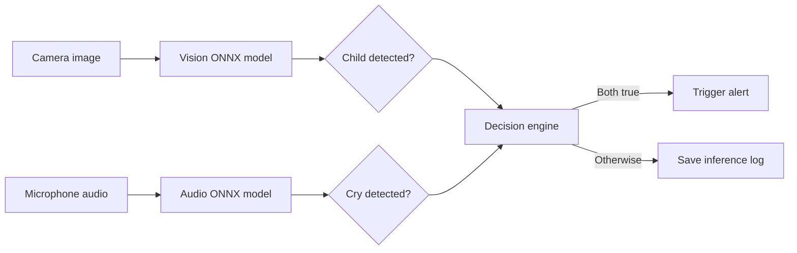
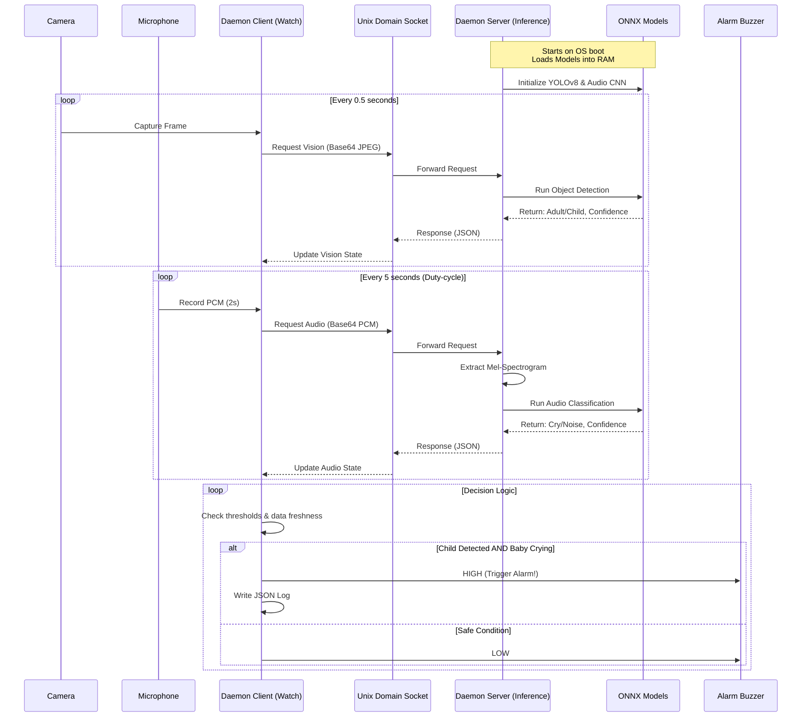

# CPDS-AI

> **Child Presence Detection System for Vehicles** — an AI research project that combines visual child detection and baby-cry recognition to support alerts for children left in vehicle cabins.

[](https://github.com/trtrung1209/CPDS-AI/actions/workflows/ci_pipeline.yml)

## Overview

CPDS-AI is designed as an offline-capable edge-AI pipeline. It combines two independent ONNX models:

| Pipeline | Model                   | Purpose                                                          |
| -------- | ----------------------- | ---------------------------------------------------------------- |
| Vision   | YOLOv8 ONNX<br />(INT8) | Detects adults and children in a vehicle image or camera stream. |
| Audio    | AudioCNN ONNX (INT8)    | Distinguishes baby cries from background noise.                  |

An alarm is triggered only when both signals are positive: a child is detected and the audio classifier identifies a cry. The target deployment path is a Raspberry Pi 4 during development and an Orange Pi 5/NPU for the final edge device.


```mermaid
flowchart LR
    A[Camera image] --> V[Vision ONNX model]
    B[Microphone audio] --> AU[Audio ONNX model]
    V --> D{Child detected?}
    AU --> C{Cry detected?}
    D --> F[Decision engine]
    C --> F
    F -->|Both true| AL[Trigger alert]
    F -->|Otherwise| LOG[Save inference log]
```

## Key Features

- Real ONNX inference for the combined vision-and-audio decision.
- Dedicated vision verification with annotated output images.
- Optional live webcam inference for local development.
- Periodic, unattended microphone recording to conserve battery on edge devices.
- Kaggle notebooks for training and export workflows.
- Automated tests with branch coverage enforced at **80% or higher**.
- Consecutive, readable Markdown reports for local test runs.
- Docker environment for headless inference deployment.

## Edge Deployment (Systemd Daemon Architecture)

To maximize performance on Edge devices like Orange Pi 5 and Raspberry Pi 4, the inference pipeline is structured as a multi-threaded **Client-Server Systemd Daemon**. This prevents reloading heavy ONNX models into memory on every frame.

### 1. Server (`cpds-inference-server`)
Loads YOLOv8 and Audio CNN ONNX models into RAM once on boot. It listens to a Unix Domain Socket, executes AI inference upon receiving Base64 data, and returns the confidence scores.

### 2. Client (`cpds-watch-client`)
A lightweight, headless background service managing two parallel threads:
- **Vision Loop**: Continually reads camera frames and sends them to the Server.
- **Audio Loop**: Follows a battery-saving Duty-Cycle (Records 2s, sleeps 3s).
The client calculates data freshness (Staleness Window) and triggers the physical Alarm (GPIO) only when both models detect an emergency.

### Sequence Diagram

```mermaid
sequenceDiagram
    participant Cam as Camera
    participant Mic as Microphone
    participant Client as Daemon Client (Watch)
    participant Socket as Unix Domain Socket
    participant Server as Daemon Server (Inference)
    participant Model as ONNX Models
    participant GPIO as Alarm Buzzer

    Note over Server, Model: Starts on OS boot<br/>Loads Models into RAM
    Server->>Model: Initialize YOLOv8 & Audio CNN
    
    loop Every 0.5 seconds
        Cam->>Client: Capture Frame
        Client->>Socket: Request Vision (Base64 JPEG)
        Socket->>Server: Forward Request
        Server->>Model: Run Object Detection
        Model-->>Server: Return: Adult/Child, Confidence
        Server-->>Socket: Response (JSON)
        Socket-->>Client: Update Vision State
    end

    loop Every 5 seconds (Duty-cycle)
        Mic->>Client: Record PCM (2s)
        Client->>Socket: Request Audio (Base64 PCM)
        Socket->>Server: Forward Request
        Server->>Server: Extract Mel-Spectrogram
        Server->>Model: Run Audio Classification
        Model-->>Server: Return: Cry/Noise, Confidence
        Server-->>Socket: Response (JSON)
        Socket-->>Client: Update Audio State
    end

    loop Decision Logic
        Client->>Client: Check thresholds & data freshness
        alt Child Detected AND Baby Crying
            Client->>GPIO: HIGH (Trigger Alarm!)
            Client->>Client: Write JSON Log
        else Safe Condition
            Client->>GPIO: LOW
        end
    end
```

## Audio Subsystem Enhancements

The audio classification pipeline has been highly optimized for edge deployment (e.g., Orange Pi 5):

- **Model Architecture**: Transitioned to a custom, lightweight `AudioCNN` (~98K parameters) specifically designed for 128x63 mel-spectrograms.
- **Quantization**: The ONNX model is exported using Static INT8 Quantization, reducing the file size by over 70% (from ~42MB to ~10MB) to accelerate loading times and reduce memory footprint.
- **Battery Optimization**: The microphone inference mode now utilizes a periodic listening cycle (e.g., record 2s, idle 3s). This significantly extends the operation window on backup battery power while remaining highly responsive to prolonged sounds like baby cries.
- **Data Integrity**: The evaluation data pipeline strictly separates the holdout validation set from the training pool using deterministic shuffling to prevent data leakage. Background noise clips (ESC-50) are dynamically processed using a sliding window to capture the loudest RMS segment rather than a random crop.

## Repository Layout

```text
CPDS-AI/
├── .github/workflows/       # GitHub Actions CI workflow
├── docker/                  # Inference Dockerfile
├── notebooks/               # Kaggle/Colab training notebooks
├── scripts/                 # Test-report generator
├── src/
│   ├── inference/           # ONNX, webcam, and combined inference modules
│   └── utils.py             # Run-directory and result persistence helpers
├── tests/                   # Unit, integration, notebook, and performance tests
├── run_tests.sh             # Full test suite with Markdown report
├── run_vision_tests.sh      # Vision-focused test and smoke-test helper
└── requirements.txt
```

The following paths are intentionally ignored by Git:

- `data/` — datasets and trained model artifacts.
- `runs/` — inference outputs.
- `test_reports/` — generated local test reports.
- `.env*`, `.kaggle/`, `venv/`, and `.venv/` — local configuration and environments.

## Requirements

- Python 3.10 or newer.
- A virtual environment is recommended.
- A webcam is required only for the live camera demo.
- Kaggle GPU is recommended for model training.

## Installation

```bash
git clone https://github.com/trtrung1209/CPDS-AI.git
cd CPDS-AI

python3 -m venv .venv
source .venv/bin/activate

python3 -m pip install --upgrade pip
python3 -m pip install -r requirements.txt
```

## Train and Export Models on Kaggle

### Vision model

1. Create a Kaggle Secret named `ROBOFLOW_API_KEY` in **Add-ons → Secrets**.
2. Grant the vision notebook access to that secret.
3. Open `notebooks/02_vision_training.ipynb` in Kaggle and enable a GPU accelerator.
4. Update the Roboflow workspace, project, and version only if you use a different dataset.
5. Run all cells.

The notebook trains YOLOv8n, validates the generated ONNX file, then writes these artifacts to `/kaggle/working/artifacts/`:

```text
best.onnx
vision_metadata.json
```

### Audio model

Attach an audio dataset to Kaggle and set `DATASET_DIR` in `notebooks/01_audio_training.ipynb`. The expected layout is:

```text
cpds-audio/
├── train/
│   ├── noise/
│   └── cry/
└── val/                    # Optional; an 80/20 split is used when omitted
    ├── noise/
    └── cry/
```

The audio notebook produces:

```text
audio_model.onnx
audio_labels.json
```

### Download model artifacts

Download the generated files and place them locally under `data/models/`:

```text
data/models/
├── best.onnx
├── vision_metadata.json
├── audio_model.onnx
└── audio_labels.json
```

Model files must not be committed to Git.

## Run Inference

### Combined vision and audio inference

```bash
python3 -m src.inference.run_inference \
  --image path/to/image.jpg \
  --audio path/to/audio.wav \
  --vision-model data/models/best.onnx \
  --audio-model data/models/audio_model.onnx \
  --audio-labels data/models/audio_labels.json
```

The result is saved as `runs/runN/inference_log.json`.

### Verify a vision model on one image

```bash
python3 -m src.inference.verify_vision \
  --model data/models/best.onnx \
  --image path/to/image.jpg
```

An annotated image is saved under `runs/runN/verified_output.jpg`.

### Verify an audio model

```bash
python3 -m src.inference.verify_audio \
  --model data/models/audio_model.onnx \
  --audio path/to/audio.wav \
  --labels data/models/audio_labels.json
```

### Live webcam inference

Run this natively on the host machine; it needs camera and display access.

```bash
python3 -m src.inference.camera_vision --model data/models/best.onnx
```

Press `q` in the preview window to stop.

## Testing and Markdown Reports

The test suite covers inference decisions, ONNX input/output validation, label handling, camera cleanup, notebook validity, and a post-processing performance guard. The full suite enforces 80% branch coverage.

```bash
# Run all tests with coverage enforcement.
python3 -m pytest

# Run all tests and create a persistent local Markdown report.
bash run_tests.sh

# Run the vision unit-test subset and create a Markdown report.
bash run_vision_tests.sh

# Run the vision subset plus a real ONNX smoke test.
bash run_vision_tests.sh --image test_anh.jpg data/models/best.onnx

# Run the vision subset plus the webcam demo.
bash run_vision_tests.sh --camera data/models/best.onnx
```

Each report-enabled run creates the next numbered directory:

```text
test_reports/
├── report1/
│   ├── test_report.md       # Human-readable English report
│   ├── test_output.txt      # Raw pytest terminal output
│   └── results.xml          # JUnit XML for tooling
├── report2/
└── reportN/
```

`test_report.md` includes the final result, pass/fail/skip counts, duration, coverage when available, every test case, and error details for failed runs. Reports stay local because `test_reports/` is ignored by Git.

## Continuous Integration

GitHub Actions runs on every push and pull request targeting `main`.

1. Sets up Python 3.10.
2. Installs required system and Python dependencies.
3. Runs `python -m pytest`.
4. Fails when tests fail or coverage is below 80%.

## Docker

Build the inference image:

```bash
docker build -t cpds-inference -f docker/Dockerfile.inference .
```

Run combined inference with local models and a writable results directory:

```bash
docker run --rm -it \
  -v "$(pwd)/data:/app/data:ro" \
  -v "$(pwd)/runs:/app/runs" \
  cpds-inference \
  python3 -m src.inference.run_inference \
    --image /app/data/sample.jpg \
    --audio /app/data/sample.wav \
    --vision-model /app/data/models/best.onnx \
    --audio-model /app/data/models/audio_model.onnx \
    --audio-labels /app/data/models/audio_labels.json
```

Do not run the webcam demo inside this Docker image unless the host camera and GUI have been explicitly configured for container access.

## Security and Development Notes

- Store the Roboflow key only in Kaggle Secrets. Never put it in a notebook, `.env` file committed to Git, issue, screenshot, or commit message.
- Revoke and replace any key that was exposed previously.
- Keep model versions as separate files and select them with CLI arguments; do not rename production models just to test them.
- Run `bash run_tests.sh` before pushing changes. Review the generated Markdown report and `git status --short` before committing.

## License

This repository is an academic research project. Add a license file before redistributing the code or trained artifacts.
